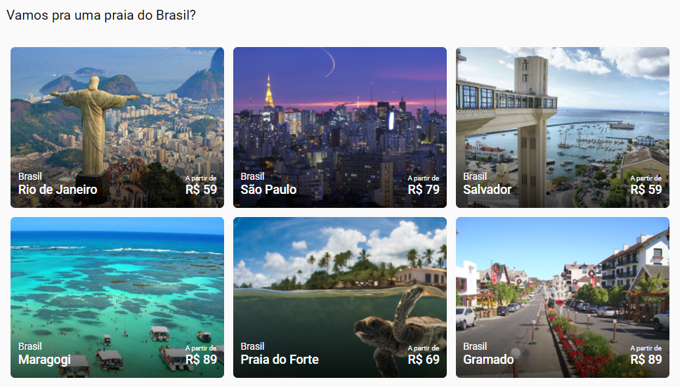

# Desafio Front-end

A proposta do desafio de front-end foi a criação de uma página de viagens e turismo.

O desafio consiste na aplicação de conceitos de responsividade, assim como utilização de `display: flex`. Apesar de não ser obrigatório, o layout da página foi aplicado em SASS.

Para visualizar a página, basta abrir o arquivo `index.html` no diretório do projeto.

## Conceitos aplicados

* Elementos semânticos de bloco
* Box-model
* Reset de margins e paddings
* Modificação de fontes
  * Importação de fontes do Google Fonts
  * Modificação de peso e tamanho
* Manipulação de imagens
  * Imagens de fundo
  * Modificação de tamanho e posicionamento
* Layout flex
  * Eixos do flexbox
  * Alinhamento do flexbox
* Responsividade
* Exibição de imagens em formato carousel

## Contato

Carolina Abreu - [Linkedin](https://www.linkedin.com/in/ana-carolina-silva-abreu-80325a195/) - anacarolinaks19@gmail.com